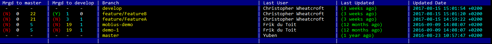

# GitSomeDetails

Little side project that started when I was playing around with Bash.

## Details

The above image is an exmaple of the output you will recieve, use the following guide to interpret the data presented in the columns:
* #### Mrgd to master
  * (Y)/(N) 
    * (Y) indicates that the branch has been merged into master
    * (N) indicated that the branch has **NOT** been merged into master
  * -/(number)
    * - (dash) is shown if the branch is master or develop
    * (number) is shown to indicate the amount of commits the branch is **behind master**
  * -/(number)
    * - (dash) is shown if the branch is master or develop
    * (number) is shown to indicate the amount of commits the branch is **ahead of master**
* #### Mrgd to develop
  * (Y)/(N) 
    * (Y) indicates that the branch has been merged into master
    * (N) indicated that the branch has **NOT** been merged into master
  * -/(number)
    * - (dash) is shown if the branch is master or develop
    * (number) is shown to indicate the amount of commits the branch is **behind develop**
  * -/(number)
    * - (dash) is shown if the branch is master or develop
    * (number) is shown to indicate the amount of commits the branch is **ahead of develop** 
* #### Branch
  * Shows the name of the branch
* #### Last User
  * Shows the last users git details who commited on the branch
* #### Last Updated
  * Shows the duriation of time since the last commit on the branch (in minutes, hours, days, monts & years)
* ####  Updated Date
  * Shows the raw datetime value of the last commit on the branch

### Common error

> fatal: unknown refname: format lstrip=3

if you encounter the above error make sure that you have updated your verion of Git to at least version 2.13.0 & this should then be resolved.